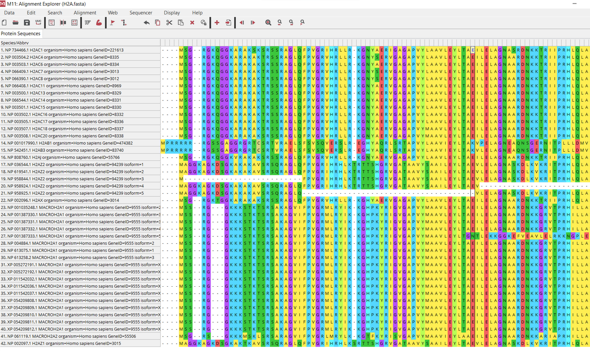
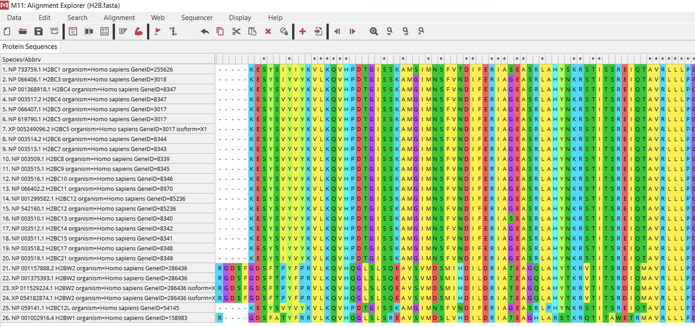
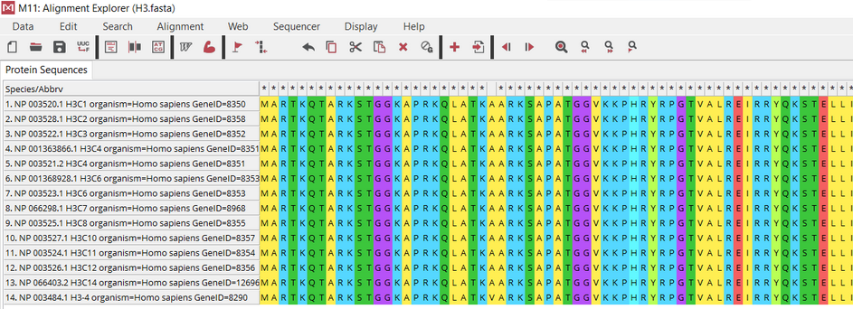
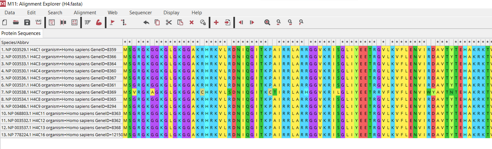
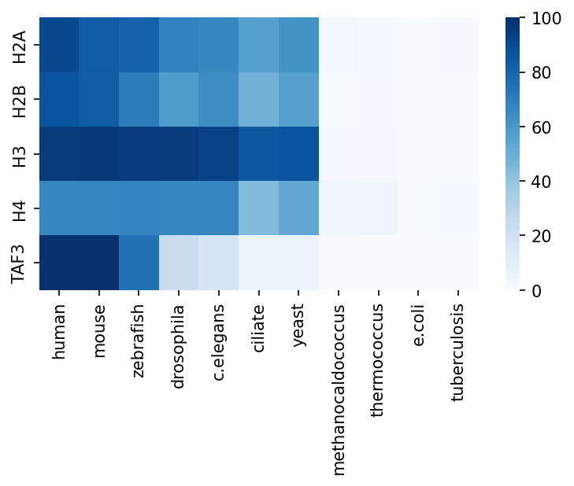

# Функция

TAF3 входит в комплекс TAFIID, который является комплексом преиницации для РНК-полимеразы II. TAFIID в свою очередь:
- Координирует деятельность более 70 полипептидов, необходимых для инициации транскрипции РНК-полимеразой II
- Связывается с основным промотором для правильного позиционирования полимеразы
- Служит основой для сборки остальных частей транскрипционного комплекса
- Действует как канал для регуляторных сигналов

Взаимодействие H3K4me3 с TAF3 регулирует сборку преинициационного комплекса и селективную активацию генов [(1)](https://www.ncbi.nlm.nih.gov/pubmed/23452851/). TAF3 способствует распознаванию и избирательности промотора и действуют как антиапоптотический фактор [(2)](https://doi.org/10.1128/mcb.21.15.5109-5121.2001).

Входит в комплекс РНК-полимеразы, поэтому экспессируется практически везде. Наибольная экспрессия в мозге, сосудах и яичниках.
Содержит два домена: цинковый палец PHD и BTF - бромодомен транскрипционного фактора.
# Выравнивание
|Название | Скриншот |
|:-:|:-:|
|H2A||
|H2B||
|H3||
|H4||

Можно наблюдать небольшой полиморфизм, однако, данные достаточно однородные, чтобы использовать BLAST более-менее честно только для одного полиморфа.

# E-value (с обрезкой < 1e-300 и > 1)
|      |    human |    mouse |   zebrafish |   drosophila |   c.elegans |   ciliate |    yeast |   methanocaldococcus |   thermococcus |   e.coli |   tuberculosis |
|:-----|---------:|---------:|------------:|-------------:|------------:|----------:|---------:|---------------------:|---------------:|---------:|---------------:|
| H2A  | 4.94e-91 | 4.57e-84 |    1.06e-81 |     2.34e-69 |    6.53e-67 |  2.45e-57 | 8.88e-63 |             0.001    |       0.15     |      1   |          0.4   |
| H2B  | 2.85e-87 | 1.15e-83 |    1.85e-71 |     3.3e-59  |    5.28e-65 |  1.91e-49 | 3.07e-57 |             1        |       0.17     |      1   |          1     |
| H3   | 2.19e-96 | 1.54e-96 |    1.77e-95 |     9.39e-96 |    4.46e-94 |  8.41e-86 | 3.31e-87 |             0.034    |       0.057    |      0.9 |          1     |
| H4   | 1.09e-67 | 7.6e-68  |    1.13e-68 |     8.02e-68 |    6.15e-68 |  1.96e-45 | 1.08e-52 |             8.22e-05 |       3.31e-05 |      1   |          0.069 |
| TAF3 | 1e-300   | 1e-300   |    1.31e-75 |     7.97e-24 |    1.38e-17 |  7.57e-07 | 5.87e-07 |             0.61     |       1        |      1   |          1     |

# -lg E_value
|      |    human |    mouse |   zebrafish |   drosophila |   c.elegans |   ciliate |    yeast |   methanocaldococcus |   thermococcus |    e.coli |   tuberculosis |
|:-----|---------:|---------:|------------:|-------------:|------------:|----------:|---------:|---------------------:|---------------:|----------:|---------------:|
| H2A  |  90.3063 |  83.3401 |     80.9747 |      68.6308 |     66.1851 |   56.6108 | 62.0516  |              3       |       0.823909 | 0         |        0.39794 |
| H2B  |  86.5452 |  82.9393 |     70.7328 |      58.4815 |     64.2774 |   48.719  | 56.5129  |              0       |       0.769551 | 0         |        0       |
| H3   |  95.6596 |  95.8125 |     94.752  |      95.0273 |     93.3507 |   85.0752 | 86.4802  |              1.46852 |       1.24413  | 0.0457575 |        0       |
| H4   |  66.9626 |  67.1192 |     67.9469 |      67.0958 |     67.2111 |   44.7077 | 51.9666  |              4.08513 |       4.48017  | 0         |        1.16115 |
| TAF3 | 300      | 300      |     74.8827 |      23.0985 |     16.8601 |    6.1209 |  6.23136 |              0.21467 |       0        | 0         |        0       |

# Heatmap

В C. elegans находим ортолог с разницей в длине |929-1007|=78 остатков. Именно его функция не изучена, но скорее всего, он обладает той же функцией, что и белок человека (содержит те же домены и обладает хорошим E-value.)